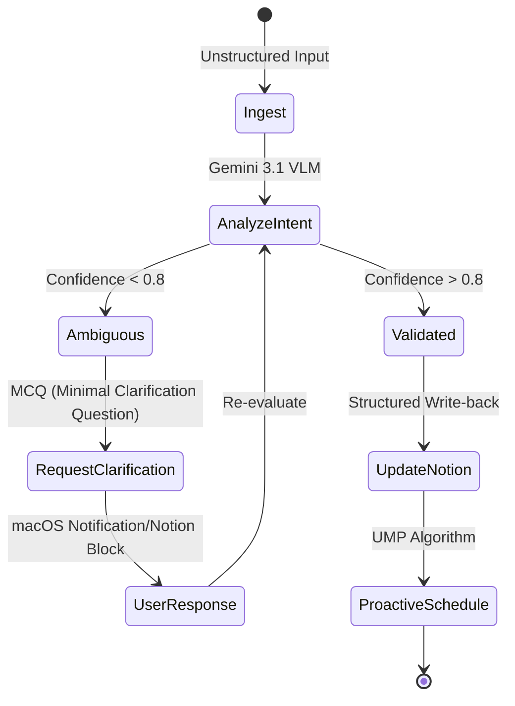

# Notion-Soul-Agent Architecture (SOTA 2024-2025)

## High-Level Workflow (Observer-Reasoner-Actor)

```text
[ Observer ] --> [ Reasoner (Brain) ] --> [ Actor ]
     ^                  |                  |
     |                  v                  |
     +----------- [ Clarification Loop ] <----+
```

### 1. Observer Layer (Multimodal Context)
- **Notion Sync:** Bidirectional polling of `Tasks [UT]` via Python SDK.
- **OS Perception:** macOS Accessibility API (`AXUIElement`) for window-level context.
- **User Ingest:** Unstructured text paste or Multimodal screenshot (Vision).

### 2. Reasoner Layer (Gemini 3.1 Flash-Lite + LangGraph)
- **Cognitive Load Monitoring (CLT):** Tracks IL, EL, and GL proxies to assess user readiness.
- **Circadian-Adaptive Planner (UMP):** Maps tasks to energy peaks derived from biometric data/historical patterns.
- **Intent Classifier:** Determines if input is Clear, Ambiguous, or Missing Data.

### 3. Actor Layer (macOS Integration)
- **Proactive Push:** `UserNotifications` with Interactive Buttons ([Approve], [Delay], [Clarify]).
- **Notion Writer:** Commits structured updates and new tasks back to Notion.
- **System Services:** Background execution via `SMAppService` / `LaunchAgent`.

## Clarification Loop State Machine



## Habit Learning Mechanism (Personalized RLHF)
- **Reward Model:** Learns from [Approve/Delay/Snooze] interactions.
- **Contextual Bandits:** Optimizes task-trigger timing based on time-of-day and task-type.
- **User Soul (LTM):** SQLite-based long-term memory of productivity patterns.
