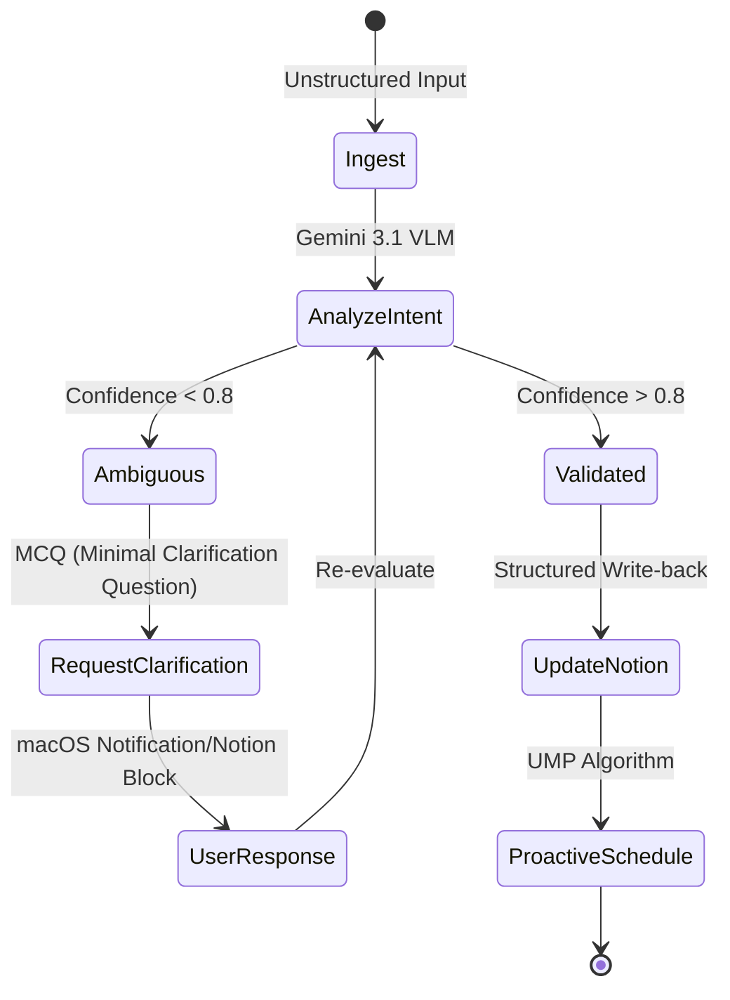

# Notion-Soul-Agent Architecture (SOTA 2024-2025)

## High-Level Workflow (Observer-Reasoner-Actor)

```text
[ Observer ] --> [ Reasoner (Brain) ] --> [ Actor ]
     ^                  |                  |
     |                  v                  |
     +----------- [ Clarification Loop ] <----+
```

### 1. Observer Layer (Multimodal Context)
- **Notion Sync:** Bidirectional polling of `Tasks [UT]` via Python SDK.
- **OS Perception:** macOS Accessibility API (`AXUIElement`) for window-level context.
- **User Ingest:** Unstructured text paste or Multimodal screenshot (Vision).

### 2. Reasoner Layer (Gemini 3.1 Flash-Lite + LangGraph)
- **Cognitive Load Monitoring (CLT):** Tracks IL, EL, and GL proxies to assess user readiness.
- **Circadian-Adaptive Planner (UMP):** Maps tasks to energy peaks derived from biometric data/historical patterns.
- **Intent Classifier:** Determines if input is Clear, Ambiguous, or Missing Data.

### 3. Actor Layer (macOS Integration)
- **Proactive Push:** `UserNotifications` with Interactive Buttons ([Approve], [Delay], [Clarify]).
- **Notion Writer:** Commits structured updates and new tasks back to Notion.
- **System Services:** Background execution via `SMAppService` / `LaunchAgent`.

## Clarification Loop State Machine



## Habit Learning Mechanism (Personalized RLHF)
- **Reward Model:** Learns from [Approve/Delay/Snooze] interactions.
- **Contextual Bandits:** Optimizes task-trigger timing based on time-of-day and task-type.
- **User Soul (LTM):** SQLite-based long-term memory of productivity patterns.

## Project Roadmap & Evolutionary Path

### Phase 1: MVP - The "Digital Soul" Core (Weeks 1-3)
- [ ] **Notion Sync Engine:** 实现 \`Tasks [UT]\` 的稳健增量同步。
- [ ] **Basic Reasoner:** 接入 Gemini 3.1 Flash-Lite，实现基础的任务重要性排序。
- [ ] **Interactive Push:** 实现带按钮的 macOS 通知，支持 [Approve/Delay]。

### Phase 2: Intelligence - Multimodal & Bio-Scheduling (Weeks 4-6)
- [ ] **Clarification Loop:** 实现针对不规范输入（截图/乱序文本）的 MCQ 询问机制。
- [ ] **UMP Scheduler:** 接入生物节奏算法，根据历史效率分布自动调整 Time-blocking。
- [ ] **Desktop Observer:** 利用 Accessibility API 感知活跃 App 状态，实现环境感知型推送。

### Phase 3: Evolution - Habit Learning & RLHF (Weeks 7+)
- [ ] **Preference Learner:** 部署 Contextual Bandits 算法，根据用户的 [Approve/Delay] 反馈自动迭代排程策略。
- [ ] **User Soul LTM:** 建立基于 SQLite 的长期记忆库，记录并总结用户的工作效率波峰。
